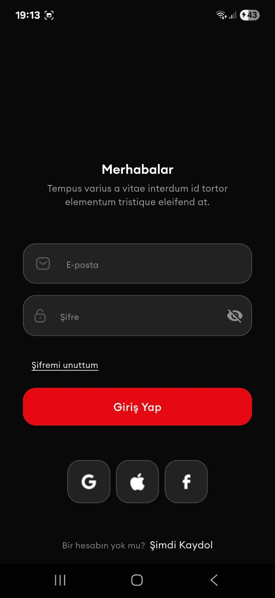
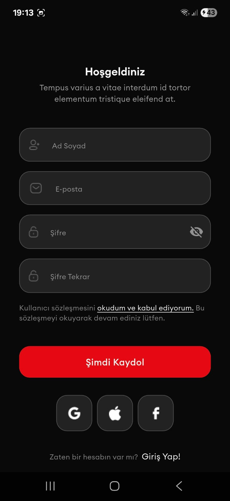
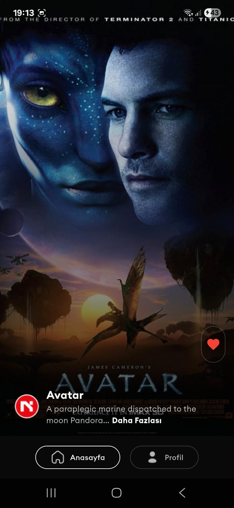
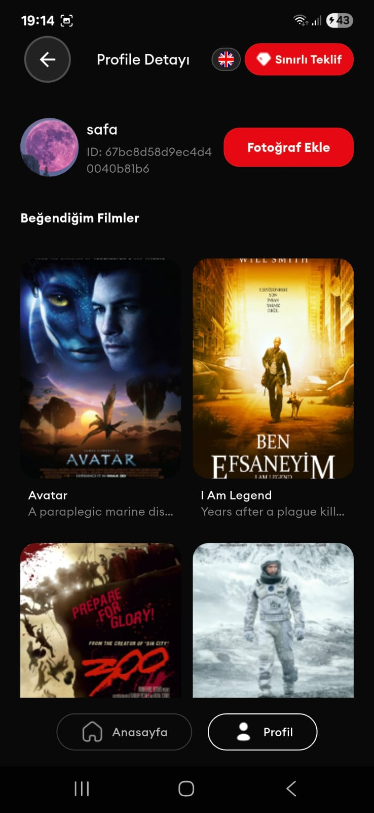
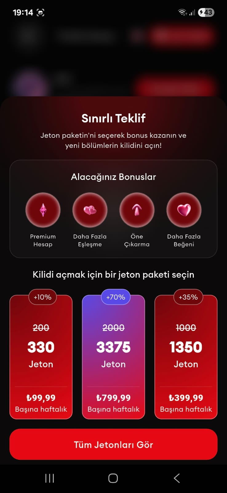
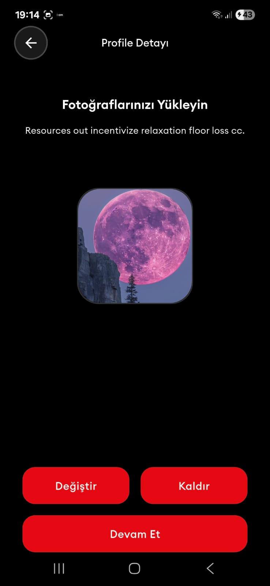

# Flutter Case Study - Movie App

A modern Flutter application built with Clean Architecture, featuring authentication, movie browsing, and profile management. This project was developed as a case study for Nodelabs.

## 📱 Screenshots

### App Screenshots
<div style="display: grid; grid-template-columns: repeat(4, 1fr); gap: 10px; margin-bottom: 20px;">
  
  
  
  
  
  
  
</div>

## 🚀 Features

### Core Requirements ✅
- **Authentication**: Secure login/register with token management
- **Home Page**: Infinite scroll movie list with pull-to-refresh
- **Profile Management**: User info display and favorite movies
- **Navigation**: Bottom navigation with state preservation
- **Clean Architecture**: MVVM with BLoC state management

### Bonus Features 🎁
- **Custom Theme**: Dark theme with consistent design system
- **Localization**: Multi-language support (English/Turkish)
- **Secure Token Storage**: Encrypted token management
- **Navigation Service**: Centralized navigation handling
- **Splash Screen**: Professional app launch experience
- **Custom App Icon**: Branded application identity

## 🏗️ Architecture

### Feature-Based Folder Structure
```
lib/
├── feature/
│   ├── auth/          # Authentication module
│   ├── home/          # Movie browsing module
│   ├── profile/       # User profile module
│   └── shared/        # Shared entities and state
├── core/              # Shared utilities
├── config/            # App configuration
└── product/           # Reusable components
```

**Why Feature-Based?** This approach provides better scalability, maintainability, and team collaboration. Each feature is self-contained with its own data, domain, and presentation layers.

### Core Layer (`lib/core/`)
Centralized utilities and services used across the entire application:
- **cache/**: Encrypted storage and caching mechanisms
- **connection/**: Network connectivity management
- **constants/**: API endpoints and configuration constants
- **error/**: Centralized error handling and failure types
- **init/**: Application initialization and setup
- **services/**: Global services (TokenService, etc.)
- **size/**: Responsive design utilities and extensions
- **usecase/**: Shared business logic
- **utils/**: Common utility functions and validators

### Product Layer (`lib/product/`)
Reusable UI components and design system:
- **componets/**: Custom components (SnackBars, Sheets)
- **constants/**: App-wide constants and durations
- **decorations/**: Custom input decorations and box decorations
- **enum/**: Application-wide enums
- **widgets/**: Reusable UI widgets (CustomButton, etc.)

### Shared Layer (`lib/feature/shared/`)
Cross-feature shared resources:
- **data/**: Shared data models (UserModel, MovieModel)
- **domain/**: Shared domain entities (UserEntity, MovieEntity)
- **state/**: Global state management (UserCubit, UserState)

### Config Layer (`lib/config/`)
Application configuration and setup:
- **theme/**: Custom dark theme with color schemes and typography
- **localization/**: Multi-language support with string constants and locale management
- **routes/**: Centralized routing with type-safe navigation service

### Dependency Injection (`lib/di/`)
Service locator pattern implementation:
- **di_container.dart**: Centralized dependency injection using Get It
- **Service Registration**: Automatic service registration and lazy loading
- **Singleton Management**: Efficient memory usage with singleton services

## 🎯 State Management

### UserCubit Implementation
The `UserCubit` manages global user state with:
- **User Authentication State**: Tracks login/logout status
- **User Data Management**: Centralized user information handling
- **Reactive Updates**: Automatic UI updates on state changes
- **Type-safe State**: Compile-time state validation
- **Global Access**: Shared user state across all features

## 🔐 Security & Token Management

### TokenService Implementation
The `TokenService` class provides centralized token management with:
- **Memory Caching**: 30-minute cache duration for fast token access
- **Encrypted Storage**: Tokens stored using `EncryptedCacheManager` with AES encryption
- **Repository Pattern**: Centralized token operations with error handling
- **Automatic Cache Management**: Smart cache invalidation and refresh mechanisms

## 🛡️ Error Handling

### Centralized Error Management
The application implements a comprehensive error handling strategy:
- **Failure Types**: Custom failure classes (ServerFailure, ConnectionFailure, etc.)
- **Error Handler**: Centralized DioException handling with proper error mapping
- **User-Friendly Messages**: Localized error messages for better UX
- **Graceful Degradation**: Proper error states and retry mechanisms
- **Snackbar Integration**: Non-intrusive error notifications

## 📱 Core Requirements Implementation

### 1. Authentication ✅
- **Login/Register**: Email-password authentication
- **Token Management**: Secure storage and automatic session handling
- **Auto-redirect**: Seamless navigation to home after successful login

### 2. Home Page Features ✅
- **Infinite Scroll**: Efficient pagination with 5 movies per page
- **Loading Indicators**: Smooth loading states and progress indicators
- **Pull-to-Refresh**: Intuitive refresh mechanism
- **Instant UI Updates**: Real-time favorite toggling without page refresh

### 3. Profile Management ✅
- **User Information**: Display user details and preferences
- **Favorite Movies**: Comprehensive list of user's favorite content
- **Profile Picture**: Image upload with cropping functionality

### 4. Navigation ✅
- **Bottom Navigation**: Intuitive tab-based navigation
- **State Preservation**: Maintains app state across navigation
- **Smooth Transitions**: Professional page transitions

### 5. Code Structure ✅
- **Clean Architecture**: Separation of concerns with clear layers
- **MVVM Pattern**: Model-View-ViewModel architecture
- **BLoC State Management**: Reactive state management with Flutter BLoC

## 🎨 Bonus Features

### Custom Theme System
- **Dark Theme**: Modern dark UI with consistent color scheme
- **Custom Components**: Reusable UI components with consistent styling
- **Typography**: Custom font family (Euclid Circular A)

### Localization
- **Multi-language**: English and Turkish support
- **Dynamic Switching**: Real-time language switching
- **Contextual Messages**: Localized error messages and UI text

### Navigation Service
- **Centralized Routing**: Single source of truth for navigation
- **Type-safe Navigation**: Compile-time route validation
- **Deep Linking Ready**: Extensible for future deep linking

### Enhanced Security
- **Encrypted Storage**: Sensitive data protection
- **Token Validation**: Automatic token verification
- **Secure API Calls**: Authenticated requests with proper headers

### Splash Screen
 - Branded app launch experience
 
### App Icon 
 - Professional application identity


## 🛠️ Technical Stack

- **Framework**: Flutter 3.8+
- **State Management**: Flutter BLoC
- **Architecture**: Clean Architecture + MVVM
- **Network**: Dio for HTTP requests
- **Storage**: Hive + Flutter Secure Storage
- **Localization**: Easy Localization
- **Dependency Injection**: Get It

## 📦 Installation

```bash
# Clone the repository
git clone https://github.com/NazimCimen/flutter_case_study.git

# Navigate to project directory
cd flutter_case_study

# Install dependencies
flutter pub get

# Run the application
flutter run
```

## 🎯 Project Highlights

- **Production Ready**: Clean, maintainable code following best practices
- **Scalable Architecture**: Easy to extend with new features
- **Performance Optimized**: Efficient data loading and caching
- **User Experience**: Intuitive UI with smooth interactions
- **Security Focused**: Secure token management and data handling

---

**Developed for Nodelabs Case Study**  
*Demonstrating modern Flutter development practices with Clean Architecture*
